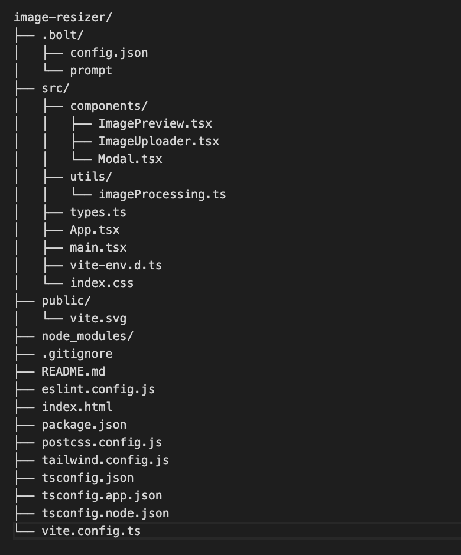

# Image Resizer

A modern web application for resizing and managing multiple images with a clean, dark-mode compatible interface. Built with React, TypeScript, and Tailwind CSS.

## Features

- 🖼️ Batch image upload with drag-and-drop support
- 📏 Resize images while maintaining aspect ratio
- 🌓 Dark mode support
- 🏷️ Image categorization
- 📦 Batch download as ZIP
- 💾 Original dimensions preservation
- 🔒 Aspect ratio locking/unlocking
- 📱 Responsive design

## Technologies

- React 18
- TypeScript
- Tailwind CSS
- Vite
- Browser Image Compression
- JSZip

## Getting Started

### Prerequisites

- Node.js (v16 or higher)
- npm or yarn

### Installation

1. Clone the repository
- bash
- git clone https://github.com/brice-dubois/image_resizer
- cd image_resizer

2. Install dependencies
- bash
- npm install

3. Start the development server
- bash
- npm run dev

4. Build for production
- bash
- npm run build

## Usage

1. **Upload Images**: 
   - Drag and drop images onto the upload area
   - Or click to select files from your device
   - Supports JPG, PNG, and GIF formats

2. **Resize Images**:
   - Click on any image to open the resize modal
   - Lock/unlock aspect ratio
   - Enter new dimensions
   - Click "Apply Changes" to resize

3. **Categorize Images**:
   - Select a category from the dropdown
   - Categories include: MAIN, PT01-PT07, OTHER

4. **Download**:
   - Download individual images using the download button
   - Use "Download All" to get a ZIP file of all images

## Project Structure

## Contributing

1. Fork the repository
2. Create your feature branch (`git checkout -b feature/AmazingFeature`)
3. Commit your changes (`git commit -m 'Add some AmazingFeature'`)
4. Push to the branch (`git push origin feature/AmazingFeature`)
5. Open a Pull Request

## License

This project is licensed under the MIT License - see the LICENSE file for details.

## Acknowledgments

- [Lucide Icons](https://lucide.dev/) for the beautiful icons
- [Browser Image Compression](https://www.npmjs.com/package/browser-image-compression) for image optimization
- [JSZip](https://stuk.github.io/jszip/) for ZIP file handling
EOL